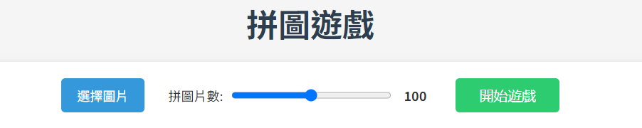
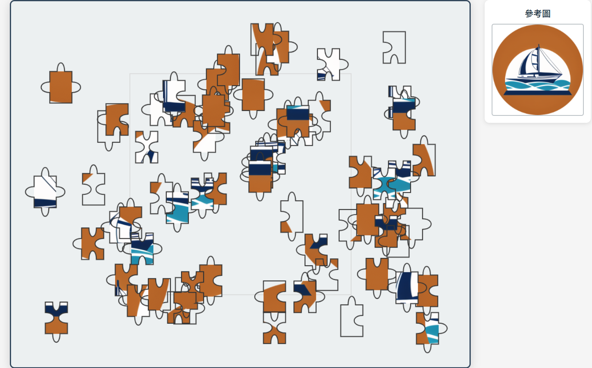
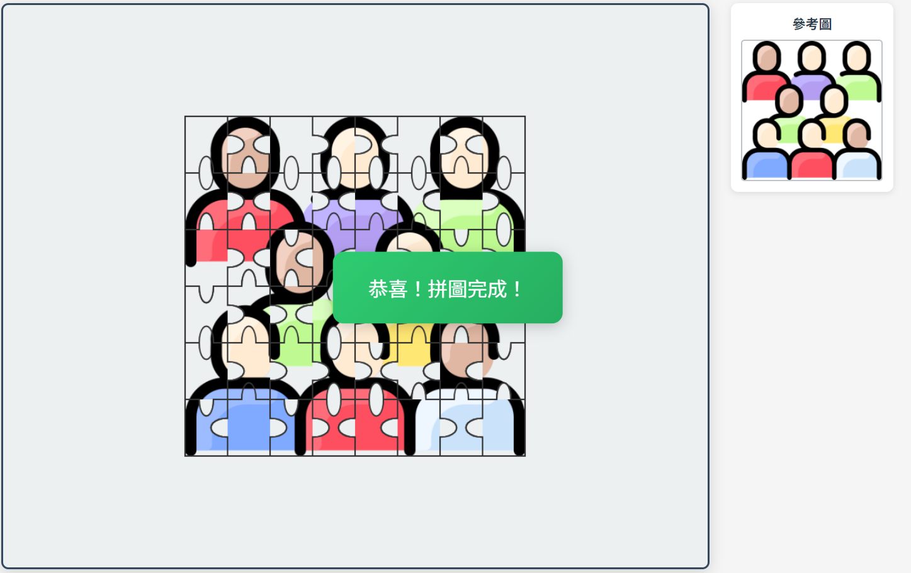

# 🧩 拼圖遊戲 (Puzzle Game)

一個使用 CoffeeScript 開發的互動式拼圖遊戲。

## 📸 預覽

*遊戲主界面*

*拼圖進行中*

*完成效果*

## ✨ 功能特點

- 🖼️ 支持自定義圖片上傳
- 🎯 可調整拼圖片數（50-150片）
- 🎮 直觀的拖放操作
- 🔄 智能的拼圖形狀匹配
- 📱 響應式設計
- 🎨 現代化UI界面

## 🛠️ 技術

  
  
  
  

-  Canvas API
- 
- 
- 

## 📦 安裝說明

無
